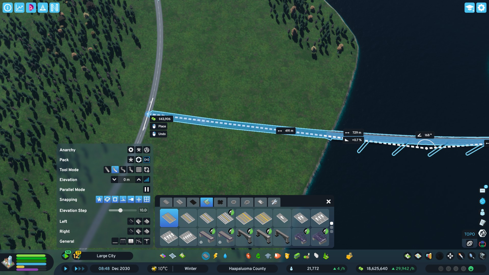
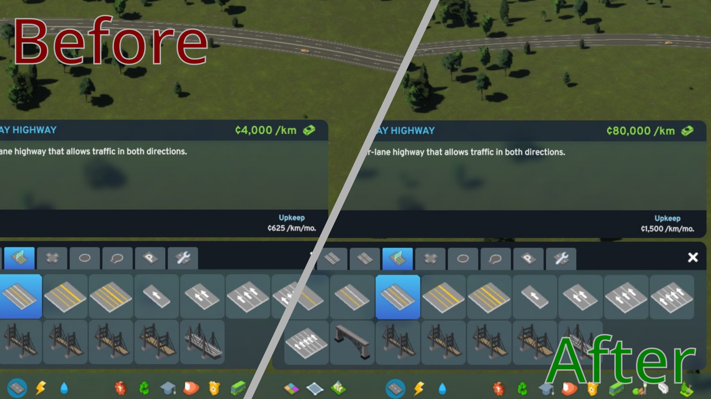

# PriceAdjuster

Cities Skylines II mod that adjusts road, track, and prefab construction costs and upkeep via configurable multipliers.




## Building the mod

Targets .NET Framework 4.8. Requires the CS2 modding toolchain environment variables to be set.
See [CS2 Modding Wiki](https://cs2.paradoxwikis.com/Modding_Toolchain) for more info.

Mod is currently developed only on Linux; for building use protontricks & wine:

```sh
protontricks-launch --appid 949230 \
  "/home/<USER>/.steam/steam/steamapps/compatdata/949230/pfx/drive_c/Program Files/dotnet/dotnet.exe" \
  build
```

The same applies when publishing the mod to PDX mods.

## Architecture

### Network pricing system & its dual design

CS2 uses for networks separate ECS components for simulation/building data and UI display data. The mod mirrors this
logic across both:

- **Net logic systems** modify `PlaceableNetComposition` -- the component backing actual in-game network costs (
  `m_ConstructionCost`, `m_UpkeepCost`).
- **Net UI systems** modify `PlaceableNetData` -- the component shown in build menus and info panels (
  `m_DefaultConstructionCost`, `m_DefaultUpkeepCost`).

Both system pairs use identical classification logic and multiplier application.

### Prefab pricing system

Roundabouts and cul-de-sacs are not networks but placeable prefabs. The mod handles these through a separate prefab
pricing system:

- **Prefab systems** modify `PlaceableObjectData` (`m_ConstructionCost`) on entities that have `NetObjectData`.
  Classification is based on `CompositionFlags.General.Roundabout`, which covers both roundabouts and cul-de-sacs.

This system uses the same non-destructive snapshot and deferred recalculation approach as the net systems.

### Non-destructive modification

When the mod first encounters a network or prefab entity, it snapshots the original `m_ConstructionCost` and `m_UpkeepCost` into
an `OriginalPlaceableNetProps` component attached to that entity. All subsequent price calculations are always
`original * multiplier`, never accumulated. Removing the mod causes the ECS systems to stop running, leaving entities
with their original values intact since the mod never persists changes to disk.

### Deferred recalculation

When a user changes a multiplier at runtime, `Mod.SchedulePriceRecalculation()` queries all entities with
`OriginalPlaceableNetProps` and stamps a `ScheduledPriceRecalculation` tag on each. The pricing systems pick these up on
their next update tick and recompute from the saved originals.

### Presets

Price multipliers are organized into four presets defined in `PriceSettings.Prices.cs`:

- **Vanilla** -- base game prices (all multipliers at 1.0x)
- **Balanced** -- moderately increased costs
- **Realistic** -- significantly increased costs
- **Custom** -- user-defined via individual sliders

Preset values are hardcoded in the `PresetsEnum` property getters. When the active preset is not `Custom`, the sliders
are hidden and the preset's values are applied directly. Switching to `Custom` enables the individual multiplier
sliders.

Upkeep multipliers have no presets and are always individually adjustable.

## Localization

Currently English only (`LocaleEN`). The mod uses Colossal's `IDictionarySource` interface.

As currently this way of localization is not documented on the CS2 Wiki, here are some examples of used helper methods:

| Helper                               | Purpose                    | Example key pattern                       |
|--------------------------------------|----------------------------|-------------------------------------------|
| `GetSettingsLocaleID()`              | Mod name in settings panel | `settings.NODE`                           |
| `GetOptionTabLocaleID(tab)`          | Tab labels                 | `settings.NODE[TAB]`                      |
| `GetOptionGroupLocaleID(group)`      | Group labels               | `settings.NODE[TAB+GROUP]`                |
| `GetOptionLabelLocaleID(property)`   | Setting labels             | `settings.NODE[TAB+GROUP.OPTION]`         |
| `GetOptionDescLocaleID(property)`    | Setting descriptions       | `settings.NODE[TAB+GROUP.OPTION].desc`    |
| `GetOptionWarningLocaleID(property)` | Confirmation dialog text   | `settings.NODE[TAB+GROUP.OPTION].warning` |
| `GetEnumValueLocaleID(enum)`         | Enum dropdown values       | `settings.NODE[TAB+GROUP.OPTION].VALUE`   |

If you want to contribute a new localization, or just fix an existing one, feel free to do so!

To add a new language, create a class implementing `IDictionarySource` with translations for all keys and register it in
`Mod.OnLoad()` via `localizationManager.AddSource("<culture-code>", new LocaleXX(settings))`.

## Used/Modified ECS Components

### Game components (read/modified)

| Component                 | Namespace      | Fields                                                                                 | Usage                                                                                                                                             |
|---------------------------|----------------|----------------------------------------------------------------------------------------|---------------------------------------------------------------------------------------------------------------------------------------------------|
| `PlaceableNetComposition` | `Game.Prefabs` | `m_ConstructionCost` (uint), `m_UpkeepCost` (float)                                    | **Modified.** Simulation-side network cost data.                                                                                                  |
| `PlaceableNetData`        | `Game.Prefabs` | `m_DefaultConstructionCost` (uint), `m_DefaultUpkeepCost` (float), `m_SetUpgradeFlags` | **Modified** (cost fields) / **Read** (flags). UI-side network cost and metadata.                                                                 |
| `PlaceableObjectData`     | `Game.Prefabs` | `m_ConstructionCost` (uint)                                                            | **Modified.** Prefab construction cost data. Used by the prefab pricing system for roundabouts and cul-de-sacs.                                   |
| `NetObjectData`           | `Game.Prefabs` | `m_CompositionFlags`                                                                   | **Read.** `CompositionFlags.General.Roundabout` distinguishes roundabouts/cul-de-sacs from other prefabs.                                         |
| `RoadComposition`         | `Game.Prefabs` | `m_Flags`                                                                              | **Read.** `RoadFlags.UseHighwayRules` distinguishes highways from regular roads.                                                                  |
| `TrackComposition`        | `Game.Prefabs` | `m_TrackType`                                                                          | **Read.** `TrackTypes` enum distinguishes train/tram/subway.                                                                                      |
| `RoadData`                | `Game.Prefabs` | `m_Flags`                                                                              | **Read.** UI-side equivalent of `RoadComposition` for the same highway check.                                                                     |
| `TrackData`               | `Game.Net`     | `m_TrackType`                                                                          | **Read.** UI-side equivalent of `TrackComposition` for track type checks.                                                                         |

### Custom components (added by mod)

| Component                     | Purpose                                                                                                                                  |
|-------------------------------|------------------------------------------------------------------------------------------------------------------------------------------|
| `OriginalPlaceableNetProps`   | Stores `OriginalPrice` (uint) and `OriginalUpkeep` (float) -- the vanilla values before modification. Attached to every modified entity. |
| `ScheduledPriceRecalculation` | Empty tag component. When present, signals the pricing systems to recompute from originals on the next tick. Removed after processing.   |
